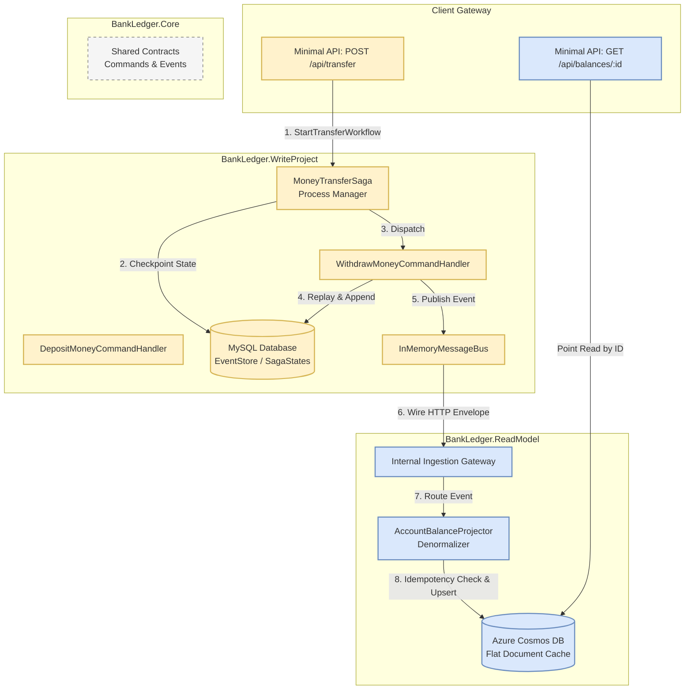
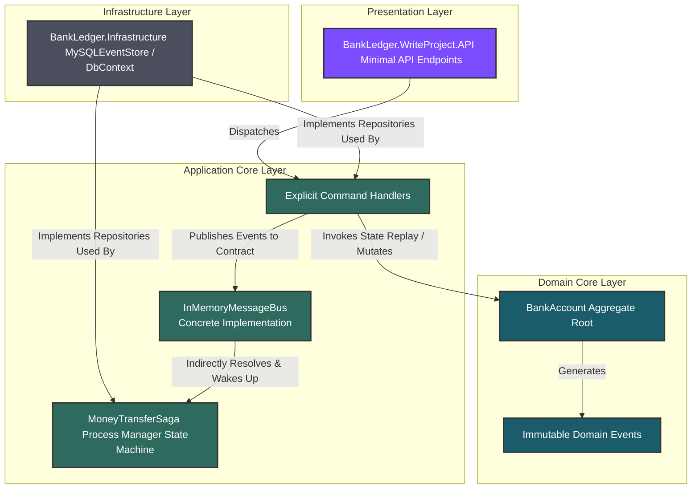
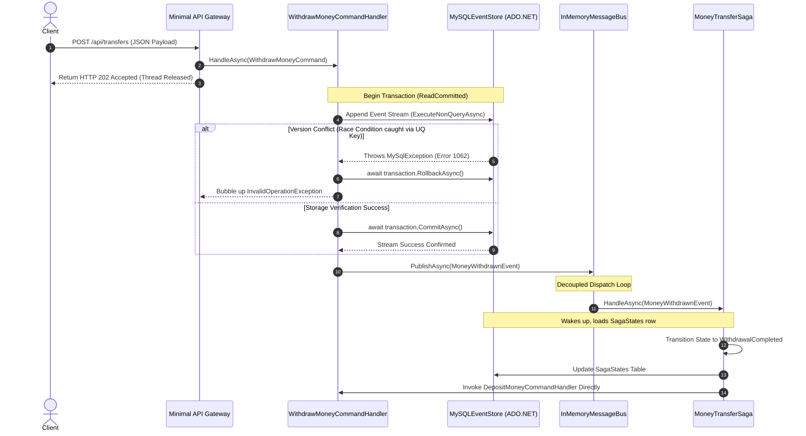

```mermaid
graph TD
    %% Styling
    classDef write fill:#fff2cc,stroke:#d6b656,stroke-width:2px;
    classDef read fill:#dae8fc,stroke:#6c8ebf,stroke-width:2px;
    classDef shared fill:#f5f5f5,stroke:#666,stroke-dasharray: 5 5;
    
    %% API / Transport Boundary
    subgraph Client Gateway
        API_POST[Minimal API: POST /api/transfer]:::write
        API_GET[Minimal API: GET /api/balances/:id]:::read
    end

    %% Write Side Project
    subgraph Write Model [BankLedger.WriteProject]
        SAGA[MoneyTransferSaga<br>Process Manager]:::write
        W_HANDLER[WithdrawMoneyCommandHandler]:::write
        D_HANDLER[DepositMoneyCommandHandler]:::write
        MYSQL[(MySQL Database<br>EventStore / SagaStates)]:::write
        BUS[InMemoryMessageBus]:::write
    end

    %% Shared Abstraction Contracts
    subgraph Shared Layer [BankLedger.Core]
        CORE[Shared Contracts<br>Commands & Events]:::shared
    end

    %% Read Side Project
    subgraph Read Model [BankLedger.ReadModel]
        INGEST[Internal Ingestion Gateway]:::read
        PROJ[AccountBalanceProjector<br>Denormalizer]:::read
        COSMOS[(Azure Cosmos DB<br>Flat Document Cache)]:::read
    end

    %% Control Flow Boundaries
    API_POST -->|1. StartTransferWorkflow| SAGA
    SAGA -->|2. Checkpoint State| MYSQL
    SAGA -->|3. Dispatch| W_HANDLER
    W_HANDLER -->|4. Replay & Append| MYSQL
    W_HANDLER -->|5. Publish Event| BUS
    BUS -->|6. Wire HTTP Envelope| INGEST
    INGEST -->|7. Route Event| PROJ
    PROJ -->|8. Idempotency Check & Upsert| COSMOS
    API_GET -->|Point Read by ID| COSMOS

    class CORE shared;

```

### Clean Architecture Project Dependency Flow (Static View)

```mermaid
graph TD
    %% Define Layers
    subgraph Presentation_Layer [Presentation Layer]
        API[BankLedger.WriteProject.API <br> Minimal API Endpoints]
    end

    subgraph Infrastructure_Layer [Infrastructure Layer]
        DB[BankLedger.Infrastructure <br> MySQLEventStore / DbContext]
    end

    subgraph Application_Core [Application Core Layer]
        Handlers[Explicit Command Handlers]
        Saga[MoneyTransferSaga <br> Process Manager State Machine]
        Bus[InMemoryMessageBus <br> Concrete Implementation]
    end

    subgraph Domain_Core [Domain Core Layer]
        Agg[BankAccount Aggregate Root]
        Events[Immutable Domain Events]
    end

    %% Define Flows (Strictly Inward)
    API -->|Dispatches| Handlers
    DB -->|Implements Repositories Used By| Handlers
    DB -->|Implements Repositories Used By| Saga
    Handlers -->|Invokes State Replay / Mutates| Agg
    Agg -->|Generates| Events
    Handlers -->|Publishes Events to Contract| Bus
    Bus -->|Indirectly Resolves & Wakes Up| Saga

    %% Styling
    classDef domain fill:#1a5c6a,stroke:#333,stroke-width:2px,color:#fff;
    classDef app fill:#2e6b5e,stroke:#333,stroke-width:2px,color:#fff;
    classDef infra fill:#4a4e5d,stroke:#333,stroke-width:2px,color:#fff;
    classDef pres fill:#7c4dff,stroke:#333,stroke-width:2px,color:#fff;

    class Agg,Events domain;
    class Handlers,Saga,Bus app;
    class DB infra;
    class API pres;

```

### Stateful Money Transfer Saga Workflow (Sequence View)

```mermaid
sequenceDiagram
 autonumber
    actor Client
    participant API as Minimal API Gateway
    participant Handler as WithdrawMoneyCommandHandler
    participant DB as MySQLEventStore (ADO.NET)
    participant Bus as InMemoryMessageBus
    participant Saga as MoneyTransferSaga

    Client->>API: POST /api/transfers (JSON Payload)
    API->>Handler: HandleAsync(WithdrawMoneyCommand)
    API-->>Client: Return HTTP 202 Accepted (Thread Released)

    Note over Handler, DB: Begin Transaction (ReadCommitted)
    Handler->>DB: Append Event Stream (ExecuteNonQueryAsync)
    
    alt Version Conflict (Race Condition caught via UQ Key)
        DB-->>Handler: Throws MySqlException (Error 1062)
        Handler->>DB: await transaction.RollbackAsync()
        Handler-->>API: Bubble up InvalidOperationException
    else Storage Verification Success
        Handler->>DB: await transaction.CommitAsync()
        DB-->>Handler: Stream Success Confirmed
    end

    Handler->>Bus: PublishAsync(MoneyWithdrawnEvent)
    Note over Bus: Decoupled Dispatch Loop
    Bus->>Saga: HandleAsync(MoneyWithdrawnEvent)
    
    Note over Saga, DB: Wakes up, loads SagaStates row
    Saga->>Saga: Transition State to WithdrawalCompleted
    Saga->>DB: Update SagaStates Table
    Saga->>Handler: Invoke DepositMoneyCommandHandler Directly
```

