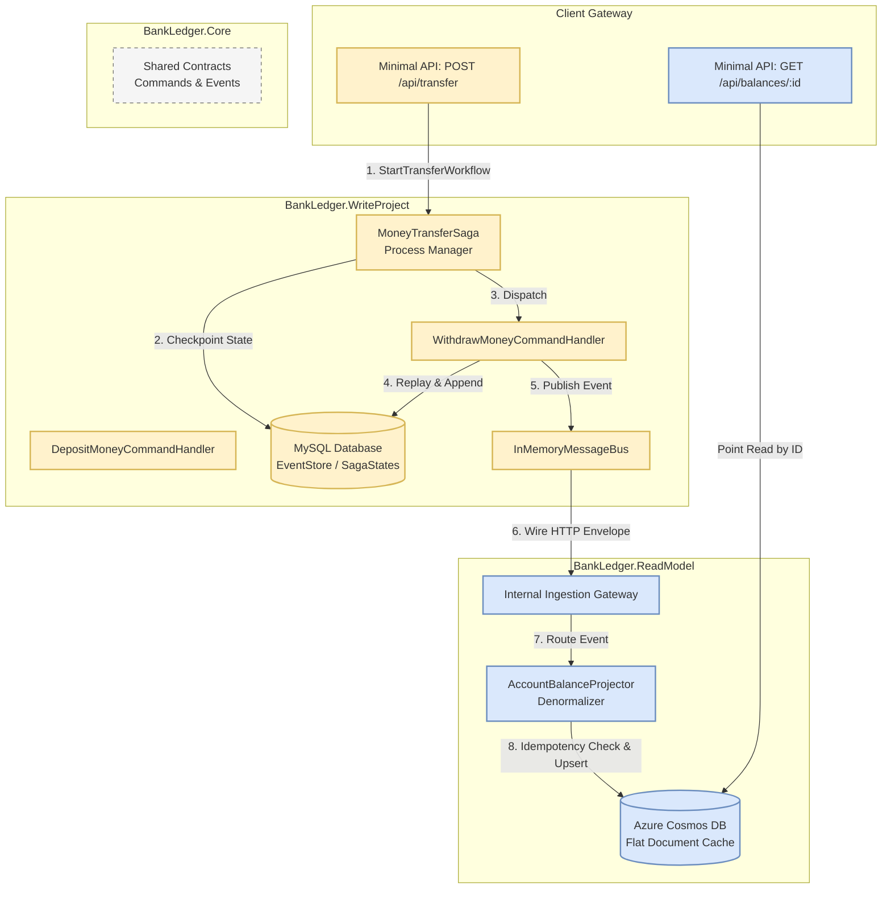

```mermaid
graph TD
    %% Styling
    classDef write fill:#fff2cc,stroke:#d6b656,stroke-width:2px;
    classDef read fill:#dae8fc,stroke:#6c8ebf,stroke-width:2px;
    classDef shared fill:#f5f5f5,stroke:#666,stroke-dasharray: 5 5;
    
    %% API / Transport Boundary
    subgraph Client Gateway
        API_POST[Minimal API: POST /api/transfer]:::write
        API_GET[Minimal API: GET /api/balances/:id]:::read
    end

    %% Write Side Project
    subgraph Write Model [BankLedger.WriteProject]
        SAGA[MoneyTransferSaga<br>Process Manager]:::write
        W_HANDLER[WithdrawMoneyCommandHandler]:::write
        D_HANDLER[DepositMoneyCommandHandler]:::write
        MYSQL[(MySQL Database<br>EventStore / SagaStates)]:::write
        BUS[InMemoryMessageBus]:::write
    end

    %% Shared Abstraction Contracts
    subgraph Shared Layer [BankLedger.Core]
        CORE[Shared Contracts<br>Commands & Events]:::shared
    end

    %% Read Side Project
    subgraph Read Model [BankLedger.ReadModel]
        INGEST[Internal Ingestion Gateway]:::read
        PROJ[AccountBalanceProjector<br>Denormalizer]:::read
        COSMOS[(Azure Cosmos DB<br>Flat Document Cache)]:::read
    end

    %% Control Flow Boundaries
    API_POST -->|1. StartTransferWorkflow| SAGA
    SAGA -->|2. Checkpoint State| MYSQL
    SAGA -->|3. Dispatch| W_HANDLER
    W_HANDLER -->|4. Replay & Append| MYSQL
    W_HANDLER -->|5. Publish Event| BUS
    BUS -->|6. Wire HTTP Envelope| INGEST
    INGEST -->|7. Route Event| PROJ
    PROJ -->|8. Idempotency Check & Upsert| COSMOS
    API_GET -->|Point Read by ID| COSMOS

    class CORE shared;

```

