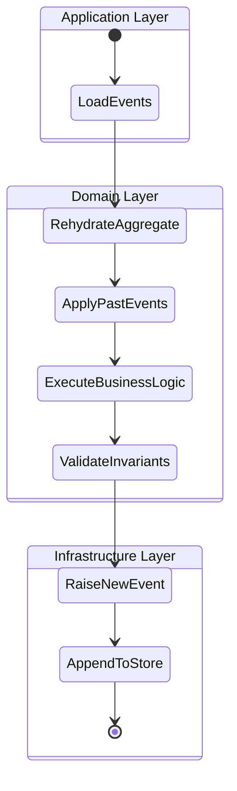
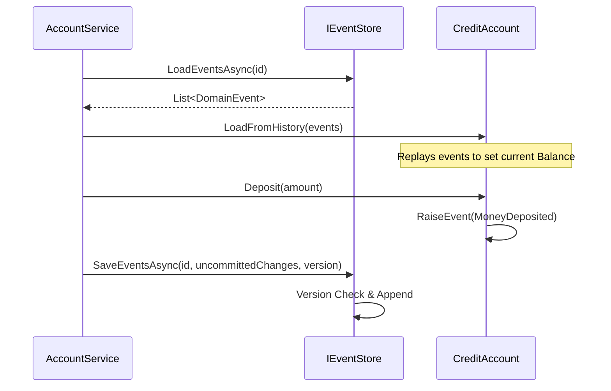

# Event-Sourced Domain Model (DDD)

A practical implementation of **Vlad Khononov's** Event Sourcing pattern using C# and .NET. This project demonstrates how to manage complex business state as a sequence of immutable facts (Events) rather than a single database row.

## 🚀 Key Architectural Concepts

- **Aggregate Root**: The `CreditAccount` serves as the consistency boundary.
- **Domain Events**: Implemented as C# `record` types for immutability.
- **State Rehydration**: The aggregate state is rebuilt by replaying events from the `EventStore`.
- **Optimistic Concurrency**: Uses `expectedVersion` to prevent "Lost Updates" in multi-user scenarios.

## 🛠 Tech Stack
- **C# / .NET 8**
- **xUnit** (Unit Testing)
- **Moq** (Dependency Mocking)
- **Microsoft DI** (Dependency Injection)

## 💎 Senior Design Decisions

- **Immutability (C# Records)**: I used `record` types for all Domain Events. Since events represent business facts that happened in the past, they must never change. Records provide built-in value-based equality and immutability.
- **The Audit Trail**: Unlike traditional CRUD where the previous state is overwritten, this model provides a 100% accurate audit log "for free." We never lose data; we only append to the history.
- **Protecting Invariants**: The `CreditAccount` Aggregate Root acts as a consistency boundary. It encapsulates business rules—such as the overdraft limit—and ensures a `WithdrawalPerformed` event is only raised if the operation is valid.
- **Separation of Concerns (Persistence Ignorance)**: The Domain layer has zero dependencies on databases or external frameworks. It only cares about business logic. This makes the core logic highly testable and decoupled from infrastructure.
- **Optimistic Concurrency**: By using an `expectedVersion` check in the `IEventStore`, the system prevents "Lost Updates." If two users attempt to modify the same account simultaneously, the version mismatch will trigger a safety conflict.

## 🧠 Core Logic: The Rehydration Flow
Unlike traditional CRUD, we don't `UPDATE Accounts SET Balance = X`. Instead:
1. **Fetch**: Get all events for `Account_123`.
2. **Replay**: Pass events to a fresh `CreditAccount` instance.
3. **Act**: Execute business rules (e.g., Overdraft checks).
4. **Append**: Save only the *new* events to the store.

## 🧪 Testing Strategy
- **Domain Tests**: Verify that business rules produce the correct events.
- **Application Tests**: Use Mocks to ensure the service coordinates between Domain and Infrastructure correctly.

## Diagrams

### Activity Flow: Command Execution
---

### Sequence Diagram for Credit Account Deposit Flow
---

---
### *Note: This is a learning project based on "Learning Domain-Driven Design" by Vlad Khononov.*
